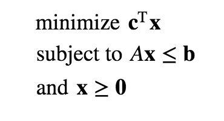

# Linear Optimization using `PuLP`
<br>

<br>

<br>

### Notebook by [Marco Tavora](https://marcotavora.me/)

## Table of contents
 
1. [Introduction](#Introduction)
2. [Linear Programming Redux](#Linear-Programming-Redux)
3. [Procedure](#Procedure)
4. [Example](#Example)


## Introduction
[[go back to the top]](#Table-of-contents)


In this notebook I will illustrate how to use `PuLP`, a linear programming `Python` package, to solve complex linear optimization problems. 

The idea here is **not** to explain how to convert practical optimization problems into precise mathematical statements, but to show how to express non-trivial objective functions and constraints (e.g., containing a multitude of indexes and things like that) in the syntax if `PuLP`.

## Linear Programming Redux

We recall that a linear programming problem has the form (in this case, a minimization problem):

<br>

<br>


## Procedure
[[go back to the top]](#Table-of-contents)

```
import pulp
from pulp import *
```

We first instantiate a maximization problem class, we'll name it `problem`:

```
prob = LpProblem('problem', LpMaximize)
```

The trickiest part of using `PuLP`'s language is learning how to declare variables properly.

For that we generally use class `LpVariable` which models an linear programming variable with the following  parameters:
- `name` (string) – The name of the variable used
- `lowbound` – The lower bound on the variable’s range
- `upBound` – The upper bound on the variable’s range
- `cat` – The category of the variable (`Integer`, `Binary` or `Continuous`)

The method `LpVariable.dicts` is particularly useful. It takes the name string and a list and builds a dictionary with keys that are concatenations of the name parameter and each of the items in the list parameter. The dictionary keys are the variables used in the constraints and utility function. 

Let us create two variables:

```
x1, x2 = LpVariable('x1', lowBound=0, upBound=40), LpVariable('x2', lowBound=2, upBound = 1000)
```

The objective function and constraints are added as follows:

```
(a, b, c, d, e, f) = (3, 2, 2, 1, 1, 1)
param = (a, b, c, d, e, f)
upper = (100, 80, 40)
prob += param[0] * x1 + param[1] * x2
prob += param[2] * x1 + param[3] * x2 <= upper[0] 
prob += param[4] * x1 + param[5] * x2 <= upper[1]
prob += x1 <= upper[2]
prob += x1 >= 0
prob += x2 >= 0
print('the problem is:\n')
```
Printing out `prob` we obtain:
```
problem:
MAXIMIZE
3*x1 + 2*x2 + 0
SUBJECT TO
_C1: 2 x1 + x2 <= 100

_C2: x1 + x2 <= 80

_C3: 2 x1 + x2 <= 100

_C4: x1 + x2 <= 80

_C5: x1 <= 40

_C6: x1 >= 0

_C7: x2 >= 0

VARIABLES
x1 <= 40 Continuous
2 <= x2 <= 1000 Continuous

```

To solve it we write:
```
status = prob.solve(GLPK(msg=0))
LpStatus[status]
print('The optimal values of x1 and x2 are:', value(x1), value(x2))
```
## Example
[[go back to the top]](#Table-of-contents)

```
def optimization_problem():

    x = pulp.LpVariable.dicts('x', s, lowBound = 0, upBound=I*J*K, cat = pulp.LpInteger)

    prob1 = pulp.LpProblem('Optimization', LpMaximize)
    prob1 += sum([x[i, j, k] * FW[i, j, k]  
                  for i in range(I) 
                  for j in range(J) 
                  for k in range(K)])

    for j in range(J):
        prob1 += lpSum([A[i, k] * x[i, j, k] for i in range(I) for k in range(K)]) <= G[j]

    for i in range(I):
        prob1 += lpSum([A[i, k] * x[i, j, k] for j in range(J) for k in range(K)]) <= F[i]  
        prob1 += lpSum([A[i, k] * x[i, j, k] for j in range(J) for k in range(K)]) >= 0
        prob1 += lpSum([x[i, j, k] for j in range(J) for k in range(K)]) <= M[i]  
        prob1 += lpSum([x[i, j, k] for j in range(J) for k in range(K)]) >= 0
        prob1 += lpSum([x[i, j, k] for i in range(I) for j in range(J) for k in range(K)]) == dict_S[i]

    prob1 += lpSum([x[i, j, 1] for i in range(I) for j in range(J)]) <= NS 
    
    for i in range(I):
        for l in range(m[i], M[i]):
            prob1 += S[i, l] >= S[i, l+1]
            
    prob1 += lpSum([x[i, j, k] for i in range(I) for j in range(J) for k in range(K)]) == dict_S[i]
    
    return prob1


I, J, K = 2, 2, 2
s = [(i, j, k) for i in range(I) for j in range(J) for k in range(K)]

(FW, A, G, F, f, M, m, R, S, NS) = ({(0, 0, 0): 10, (0, 0, 1): 11, 
                                     (0, 1, 0): 12, (0, 1, 1): 9, 
                                     (1, 0, 0): 13, (1, 0, 1): 17, 
                                     (1, 1, 0): 10, (1, 1, 1): 8}, 
                                    {(0, 0): 5, (0, 1): 7, 
                                     (1, 0): 9, (1, 1): 6}, 
                                    {0: 26, 1: 21}, {0: 6, 1: 8}, 
                                    {0: 4, 1: 6}, {0: 4, 1: 3}, 
                                    {0: 2, 1: 1}, 
                                    {(0, 2): 10, (0, 3): 5, 
                                     (0, 4): 2, (1, 1): 15, 
                                     (1, 2): 10, (1, 3): 5}, 
                                    {(0, 2): 1, (0, 3): 0, 
                                     (0, 4): 0, (1, 1): 1, 
                                     (1, 2): 0, (1, 3): 0}, 
                                    12)

dict_S = {}
for i in range(I):
    dict_S[i] = sum([S[i, l] for l in range(m[i], M[i]+1)])

prob1 = optimization_problem()

print(prob1)
```
The output is:
```
Optimization:
MAXIMIZE
10*x_(0,_0,_0) + 11*x_(0,_0,_1) + 12*x_(0,_1,_0) + 9*x_(0,_1,_1) + 13*x_(1,_0,_0) + 17*x_(1,_0,_1) + 10*x_(1,_1,_0) + 8*x_(1,_1,_1) + 0
SUBJECT TO
_C1: 5 x_(0,_0,_0) + 7 x_(0,_0,_1) + 9 x_(1,_0,_0) + 6 x_(1,_0,_1) <= 26

_C2: 5 x_(0,_1,_0) + 7 x_(0,_1,_1) + 9 x_(1,_1,_0) + 6 x_(1,_1,_1) <= 21

_C3: 5 x_(0,_0,_0) + 7 x_(0,_0,_1) + 5 x_(0,_1,_0) + 7 x_(0,_1,_1) <= 6

_C4: 5 x_(0,_0,_0) + 7 x_(0,_0,_1) + 5 x_(0,_1,_0) + 7 x_(0,_1,_1) >= 0

_C5: x_(0,_0,_0) + x_(0,_0,_1) + x_(0,_1,_0) + x_(0,_1,_1) <= 4

_C6: x_(0,_0,_0) + x_(0,_0,_1) + x_(0,_1,_0) + x_(0,_1,_1) >= 0

_C7: x_(0,_0,_0) + x_(0,_0,_1) + x_(0,_1,_0) + x_(0,_1,_1) + x_(1,_0,_0)
 + x_(1,_0,_1) + x_(1,_1,_0) + x_(1,_1,_1) = 1

_C8: 9 x_(1,_0,_0) + 6 x_(1,_0,_1) + 9 x_(1,_1,_0) + 6 x_(1,_1,_1) <= 8

_C9: 9 x_(1,_0,_0) + 6 x_(1,_0,_1) + 9 x_(1,_1,_0) + 6 x_(1,_1,_1) >= 0

_C10: x_(1,_0,_0) + x_(1,_0,_1) + x_(1,_1,_0) + x_(1,_1,_1) <= 3

_C11: x_(1,_0,_0) + x_(1,_0,_1) + x_(1,_1,_0) + x_(1,_1,_1) >= 0

_C12: x_(0,_0,_0) + x_(0,_0,_1) + x_(0,_1,_0) + x_(0,_1,_1) + x_(1,_0,_0)
 + x_(1,_0,_1) + x_(1,_1,_0) + x_(1,_1,_1) = 1

_C13: x_(0,_0,_1) + x_(0,_1,_1) + x_(1,_0,_1) + x_(1,_1,_1) <= 12

_C14: x_(0,_0,_0) + x_(0,_0,_1) + x_(0,_1,_0) + x_(0,_1,_1) + x_(1,_0,_0)
 + x_(1,_0,_1) + x_(1,_1,_0) + x_(1,_1,_1) = 1

VARIABLES
0 <= x_(0,_0,_0) <= 8 Integer
0 <= x_(0,_0,_1) <= 8 Integer
0 <= x_(0,_1,_0) <= 8 Integer
0 <= x_(0,_1,_1) <= 8 Integer
0 <= x_(1,_0,_0) <= 8 Integer
0 <= x_(1,_0,_1) <= 8 Integer
0 <= x_(1,_1,_0) <= 8 Integer
0 <= x_(1,_1,_1) <= 8 Integer
```
Solving it:
```
prob1.writeLP("prob1.lp")
prob1.solve()
print("Status:", LpStatus[prob1.status])
lst_v = []
for v in prob1.variables():
    print(v.name, "=", v.varValue)
    lst_v.append(v.varValue)

print("Maximum objective function =", value(prob1.objective))
```
we obtain:
```
Status: Optimal
x_(0,_0,_0) = 0.0
x_(0,_0,_1) = 0.0
x_(0,_1,_0) = 0.0
x_(0,_1,_1) = 0.0
x_(1,_0,_0) = 0.0
x_(1,_0,_1) = 1.0
x_(1,_1,_0) = 0.0
x_(1,_1,_1) = 0.0

Maximum objective function = 17.0
```

